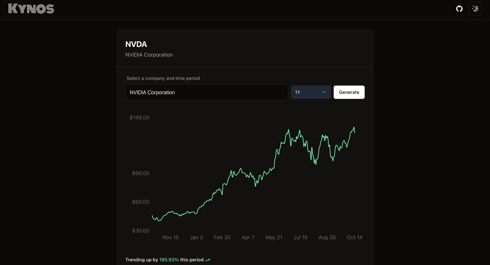

# Kynos: Interactive Stock Chart Generator



Test it out at **[kynos.cc](https://kynos.cc)**

## Overview

Kynos is a sophisticated web application that allows users to generate and visualize interactive stock charts. Built with Next.js, React, and TypeScript, it provides a seamless and responsive user experience for exploring historical stock data.

## Features

- **Interactive Stock Search**: Utilizes Fuse.js for fast, fuzzy searching of stock symbols and company names.
- **Dynamic Chart Generation**: Creates responsive, interactive line charts using Recharts.
- **Customizable Time Periods**: Users can select from various time ranges (1M, 3M, 6M, 1Y, 2Y, 5Y) to view stock performance.
- **Real-time Data**: Fetches up-to-date stock data from the Polygon.io API.
- **Dark Mode Support**: Seamless integration with system preferences and manual theme toggling.
- **Responsive Design**: Optimized for both desktop and mobile viewing experiences.
- **Performance Optimized**: Implements caching strategies and efficient data handling for quick load times.

## Technology Stack

- **Frontend**: Next.js, React, TypeScript
- **Styling**: Tailwind CSS
- **Charts**: Recharts
- **Search**: Fuse.js
- **API**: Next.js API Routes
- **Data Source**: Polygon.io API

## Getting Started

### Prerequisites

- Node.js (v14 or later)
- npm or yarn
- Polygon.io API key

### Installation

1. Clone the repository:
   ```
   git clone https://github.com/yourusername/kynos.git
   cd kynos
   ```

2. Install dependencies:
   ```
   npm install
   ```
   or
   ```
   yarn install
   ```

3. Set up environment variables:
   Create a `.env.local` file in the root directory and add your Polygon.io API key:
   ```
   POLYGON_API_KEY=your_api_key_here
   ```

4. Run the development server:
   ```
   npm run dev
   ```
   or
   ```
   yarn dev
   ```

5. Open [http://localhost:3000](http://localhost:3000) in your browser to see the application.

## Usage

1. Use the search bar to find a stock by company name or symbol.
2. Select a time period from the dropdown menu.
3. Click "Generate" to create the stock chart.
4. Interact with the chart to view specific data points.

## Project Structure

- `app/`: Next.js app router and API routes
- `components/`: React components including `InteractiveStockChart` and `StockSearch`
- `lib/`: Utility functions and helpers
- `public/`: Static assets

## Contributing

Contributions are welcome! Please feel free to submit a Pull Request.

## License

This project is licensed under the MIT License - see the [LICENSE](LICENSE) file for details.

## Acknowledgments

- Original concept forked from [aryanvichare/stocks](https://github.com/aryanvichare/stocks)
- Stock data provided by [Polygon.io](https://polygon.io/)
- Fuzzy search by [Fuse.js](https://fusejs.io/)

## Contact

For any queries or suggestions, please open an issue on this repository.
